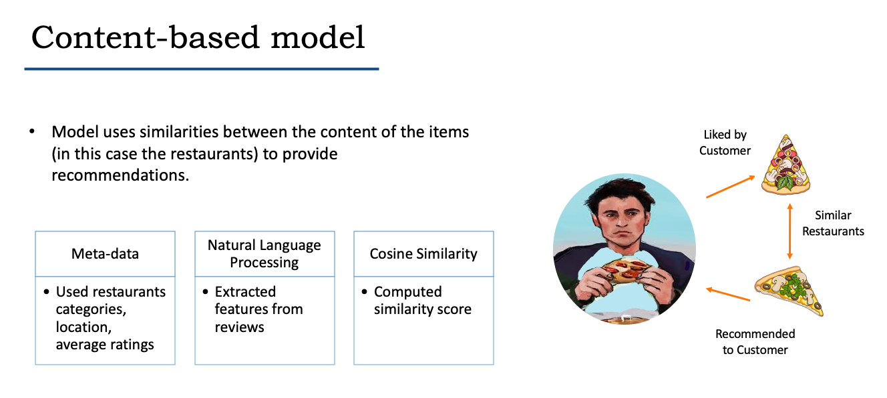

# **TORONTO RESTAURANT RECOMMENDER**

## **Introduction – motivation and goal**
How do you find new restaurants? More often than not, either someone recommends a restaurant to us or we look for online recommendations. The recommendation systems have become such an important part of our lives, that many times we don’t even realize their existence. Most, if not all, online shopping portals, social networking sites, and news feeds rely on some or the other kind of recommendation engine to optimize user experience. 
Research shows that a proliferation of options does not imply a higher user satisfaction or an increase in business revenue. Creating a curated list of options for customers can lead to more business. Thus, the recommendation systems are highly important from a business perspective (see figure1). 
I was motivated to understand how these systems work. Moreover, I greatly enjoy food and trying new restaurants, so I wanted to build a recommendation system for Toronto-based restaurants. I used machine learning techniques to build these systems. 

The repository contains the following files:
* Exploratory Data Analysis - Explains the process of culling out the data and data cleaning
* Content-based model - Code for building the recommendation system from a content-based approach
* Collaborative filtering model - Code for building the recommendation system from a collaborative filtering approach

## **The dataset**
I used the dataset released by Yelp, which is an online platform having information about various businesses and the ratings and reviews given by users. I had three different tables containing information on users, restaurants and reviews in json format. I combined these tables and culled out information on Toronto-based restaurants. Ultimately, I ended up with more than 5,400 restaurants, and more than 300,000 reviews and ratings given by 80,000+ users. These tables had metadata on the restaurants and the users.
There were around 314 categories of the restaurants, with nightlife, bar and cafes being the leading categories.

## **Building the recommendation systems**
I used two different approaches to build these models- one focuses on the similarities between the restaurants while the other exploits similarities between user preferences to generate recommendations.
### **Content-based recommendation model**

As the name suggests, this particular model uses the similarities between the content of the items (in this case the restaurants) to provide recommendations. I have built a recommendation system where the user has to input the name of restaurant and the system will provide five recommendations similar to the input restaurant.
To build this model, I used the restaurant metadata- categorical information about the various cuisine served by a restaurant and other tags like nightlife, bar, etc. I also used the average rating and the number of reviews received by each restaurant.
The dataset provided some information about other attributes about the restaurants, for instance, if a restaurant had valet parking, if they accepted credit card, and so on. However, these attributes had a lot of null values (sometimes close to 90%).  As, such I had to drop them.
Fortunately, the dataset had reviews given by various users to the restaurants. These reviews, in many cases, included information on the restaurants- dishes served, what’s good, services provided- and also reflected the user’s opinion.  I decided to extract features from these reviews. Following is a sample review:
“Oh man. You wanna get filled up, go here immediately. And good food… They have torched salmon - which is pretty uncommon, I think - and crazy tasty tofu bowl. It's pretty sweet, but there's an awesome mix of ingredients and textures. It's heavier than some poke, mostly because of delicious delicious sauces. So don't expect to be all low cal/carb with this place. Think comfort food poke…. So, go try.”

I used the Natural Language Toolkit (NLTK) to process the reviews. I used a customized tokenizer function and applied stemming and then used the term frequency- inverse document frequency measure (tf-idf). The tf−idf is made of two measures, term frequency (tf) and inverse document frequency (idf). 
For a term (a word or phrase), t, and a document, d, the term frequency 𝑡𝑓(𝑡,𝑑), measures how common the term is in the document. The inverse document frequency of a term 𝑡, 𝑖𝑑𝑓(𝑡), is the inverse of the number of documents a term 𝑡, appears in. The more common a term is across all documents the more 𝑖𝑑𝑓(𝑡) shrinks, while the more common a term is within one document the more 𝑡𝑓(𝑡,𝑑) grows. The term frequency inverse document frequency is simply the product of these two. 
The number of reviews received by the restaurants varied quite a lot, with some restaurants having more than 2000 reviews, while some only having 3 reviews. To circumvent this problem, I used wherever possible 5 reviews and in case a restaurant had less than 5, then I used all the available reviews.
After converting these into numerical features, I used the cosine similarity metrics to compute the similarity between the restaurants and ultimately make recommendations. If we think of the various features of each restaurant being a vector in a multi-dimensional space, this metric captures the orientation rather than the distance between the vectors. Mathematically, it measures the cosine of the angle between the two vectors. 
### **Collaborative filtering model**
This model exploits the similarities between the preferences of the users and the past ratings given by a user to generate recommendations. 
For creating this recommendation system, I used a Scikit-learn library called Surprise. This library helps to build and analyze recommender systems that deal with rating data. 
In case of recommendations, it is hard to evaluate accuracy because we don’t have the actual ratings against which we can compare our predictions. However, Surprise has built-in features that help to calculate the accuracy of various machine learning models, and thus helps to optimize the hyperparameters of a model and build a more efficient system. 
To build this model, I used the restaurant-id, the user-id and the ratings given by the users to the various restaurants to make recommendations. I first tried to fit a baseline model which predicts the ratings assuming they are normally distributed. Then I fitted a Singular Value Decomposition model (SVD). This model breaks down the sparse user-item rating matrix into two smaller matrices containing user and item features. It then predicts the ratings based on the dot product of these two matrices. 
By fine-tuning its hyperparameters using cross-validation, I was able to decrease the root mean square error (RMSE) by 30% from the baseline model. The RMSE measures the standard deviation of the error terms from the actual values. The model minimizes the error term using stochastic gradient descent algorithm. 
Based on these ratings, I generated recommendations from the list of restaurants not yet rated by a user. 
## **Findings and conclusions**
Both these models have their own pros and cons. While the content-based model can provide recommendations even when we don’t have any user data, it does not capture user preferences or provides recommendations across various categories.
On the other hand, the collaborative filtering model while taking into account user preferences, suffers from the cold-start problem (it needs user ratings to generate recommendations).
## **Summary and future directions**
From the above it’s clear that both the models have their own merits. In the future, I want to capitalize on each of their plus points and build a more sophisticated and hybrid model. I would like to scale the model to include North America wide data and eventually build an application.
I am also interested in studying if there are any discernible patterns between a restaurant’s average rating and its category as well as location. For instance, are Chinese restaurants in general doing particularly well in a particular locality, or vegan restaurants are not doing well in certain pockets. It would be interesting to study these patterns.

